# Deploys 
Each version will be described on:
- [Github Releases](https://github.com/coderenan/flutter-segment-analytics)
- [CHANGELOG.md](https://github.com/coderenan/flutter-segment-analytics/blob/main/CHANGELOG.md)

## How to

```mermaid
sequenceDiagram
  participant Dev as Desarrollador 👤
  participant CI as Github CI
  participant PUB as Pub Dev
  
  Dev->>CI: Commit new version (pub and changelog)
  Dev->>CI: Create a Github Release
  CI->>PUB: Deploy
```

